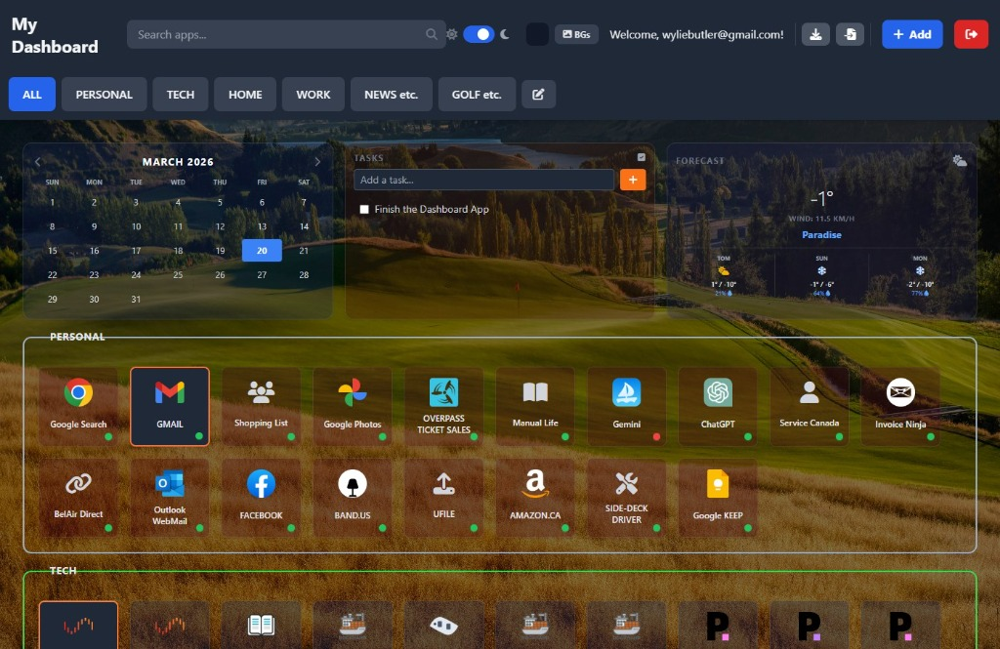

# My Personal Dashboard v3.0.0



A self-hosted, full-stack remote dashboard application featuring a modern **Glassmorphism** UX, driven by a Node.js (TypeScript) API block and a pure JavaScript frontend running exclusively isolated within Docker.

## How to Run

1.  Ensure Docker and Docker Compose are installed.
2.  Clone this repository:
    ```bash
    git clone https://github.com/wyliebutler/my-dashboard.git
    cd my-dashboard
    ```
3.  Create your own secret `.env` file. You can copy the template:
    ```bash
    cp .env.sample .env
    ```
4.  Edit the `.env` file and add your own unique secret:
    ```bash
    nano .env
    # Add a line like: JWT_SECRET=my-super-random-key
    ```
5.  Run the application. Docker will automatically create the database volume.
    ```bash
    docker compose up -d --build
    ```
6.  The dashboard will be available at `http://<your-server-ip>:4446`.

7.  Use the EXPORT and IMPORT function to make a backup of your cards. Especially useful for testing the app.

## Project Structure

The codebase has been refactored for modularity:

### Frontend (`/frontend`)
-   `index.html`: The main entry point.
-   `css/styles.css`: Contains all custom styles and Tailwind directives.
-   `js/app.js`: Contains the application logic (state management, API calls, UI rendering).

### Backend (`/backend`)
-   `server.ts`: The main entry point (TypeScript).
-   `database.ts`: The core SQLite integration interface mapping all the persistent database constraints.
-   `routes/`: Separate files for each API feature (`auth.ts`, `dashboard.ts`, `tiles.ts`, `health.ts`, etc.).
-   `middleware/`: Reusable middleware (e.g., `authMiddleware.ts`).
-   `types.ts`: Shared TypeScript interfaces.

## Features

- **Glassmorphism UI:** Stunning frosted-glass modals, native translucency, and lightweight dynamic CSS backdrops that elegantly bleed custom wallpapers directly into the UI.
- **Dynamic Tile Layouts:** Drag and drop tile interfaces natively integrated with customizable frosted borders and URL shortcuts.
- **Top-Tier Widgets:** A permanent unified dashboard header natively supporting an explicit isolated Work/Personal Google Calendar grid, a To-Do list with local-storage caching, a multi-day Geocoding Weather component, and an automated Round-Robin RSS News proxy.
- **Icon Support:** Built-in dashboard icons picker securely bound to the sprawling FontAwesome network.
-### **5. Server Background Gallery**
Upload, store, and manage custom background images securely on your dashboard's backend. 
- **Account Syncing**: The currently active background image and solid color fallbacks are synced alongside your tiles so your layout instantly carries over across any computer or browser.
- **High-Res Uploads**: Supports **up to 50MB** image uploads natively via `nginx.conf` proxy forwarding limits, bypassing standard 1MB web limits.
- **Base64 JSON Transport**: Backgrounds are transported safely via Base64 encoded JSON over the API, saving files seamlessly into the underlying SQLite database with robust TypeScript (`routes/backgrounds.ts`) validation.
### Heartbeat (Service Health Check)
Click the **Heartbeat icon** (pulse) in the header to check the status of your services.
-   **Green Dot**: Service is reachable (UP).
-   **Red Dot**: Service is unreachable (DOWN).
3.  **Rebuild**: After making changes, rebuild the containers:
    ```bash
    docker-compose up -d --build
    ```

If you want to create tiles for your windows apps you can use this work-a-round.  Here are the steps.

1.  Create a folder to hold your launcher.bat file you will create.  The file contents will look like this:
*******************************************
@echo off
REM --- This script silently launches local apps from a URL ---

REM Get the full URL (e.g., "launch://notepad/")
set APP_URL=%~1

REM Clean the URL to get just the app name
REM This removes "launch://" and the final "/"
set APP_NAME=%APP_URL:launch://=%
set APP_NAME=%APP_NAME:/=%

REM --- ADD YOUR APPS HERE ---
if /I "%APP_NAME%"=="notepad" (
    start "" "C:\Windows\System32\notepad.exe"

)
if /I "%APP_NAME%"=="Notepad++" (
    start "" "C:\Program Files\Notepad++\notepad++.exe"
)

REM Add more "if" blocks here for other apps
exit
******************************************
2.  Create a registry file to allow for the "launch" protocol.  Clicking on this file will add it to your registry. Here's the contents:
******************************************
Windows Registry Editor Version 5.00

[HKEY_CLASSES_ROOT\launch]
@="URL:Launch Protocol"
"URL Protocol"=""

[HKEY_CLASSES_ROOT\launch\shell]

[HKEY_CLASSES_ROOT\launch\shell\open]

[HKEY_CLASSES_ROOT\launch\shell\open\command]
@="\"C:\\dashboard-launcher\\launcher.bat\" \"%1\""
*********************************************
3.  Create your tile as normal.  In the APP URL field place: launch://notepad. Note:  Make this exactly same as the APP_NAME you have in your your launcher.bat file.   If you have the path and name correct your app should launch.
